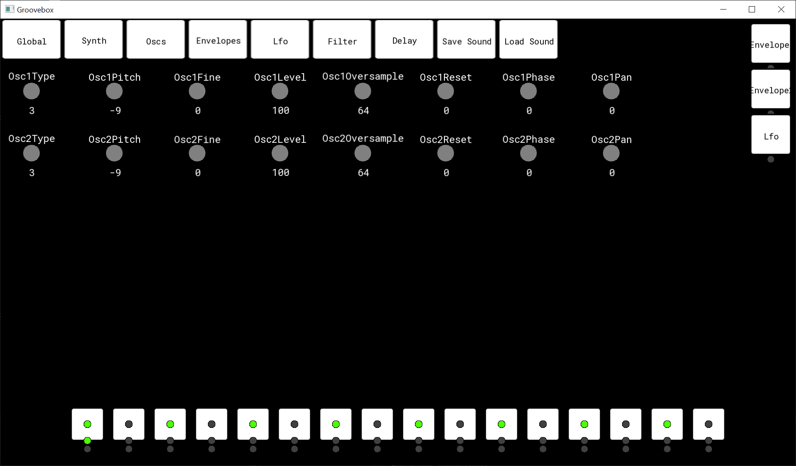

# Groovebox

## Getting started

I'm developing this with Visual Studio Community 2019 16.6.4.

The solution project is at Groovebox\Groovebox.sln.

The SFML binaries in the project are only 32 bit right now, so before you do anything else you want to switch the platform architecture to x86 instead of x64. You should probably also turn on "show all files" in the solution explorer.

The app is fairly CPU-intensive, so to prevent audio stuttering you probably want to run the Release configuration instead of Debug, unless you're trying to debug something. If you're still experiencing stuttering, make sure your CPU isn't being throttled, like make sure your power plan is high performance. If after that you're still experiencing audio stuttering, consider changing `Constants::NumTracks` from `8` to `1` in `Constants.h`.

## Usage

The app is currently in development and things here might change.

At the top of the screen are buttons to access the different pages. Each page provides a different set of control dials to modify the current sound. You can click and drag up and down on a dial to adjust its value.

- Global: Controls shared by all tracks
- Synth: Controls for note (pitch), velocity (currently unused), step length, filter
  mix, and volume (by default modulated by envelope 1).
- Oscs: Controls for two oscillators, like type (waveform), pitch, level, etc.
- Envelopes: Controls for attack, decay, sustain, release, and
  amount.
- Lfo: Controls for type (shape), frequency, and amount.
- Filter: Controls for type (LP / HP etc. as well as slope), pitch
  (frequency), Q (resonance), and Gain (unused?).
- Delay: Controls for things like send, feedback, wet and dry amounts, etc.
- Save Sound: Lets you save the sound for the current track to a json file
  written to the Groovebox\Sounds directory.
- Load Sound: Lets you load a sound to the current track. Currently you have
  to enter the name of an existing sound that's been saved to the Groovebox\Sounds directory.

On the right side of the screen are buttons to select modulation sources. When one of these is selected, you can right click and drag on a dial to adjust the modulation amount from that source. You can middle click on the dial to remove the modulation.

On the button of the screen are the step toggles. These show which steps are active and will trigger to produce sound. Clicking on a toggle will turn it on or off. Right clicking will select a step without toggling it. Holding shift and sight clicking, you can select several steps at once. When a step is selected, you can right click and drag on a dial to change the value of that dial for the selected steps only. You can middle click on the dial to remove the per-step value.

Not pictured, you can press 1-8 to select which track you're editing. Each track has a different sound and a different pattern.
